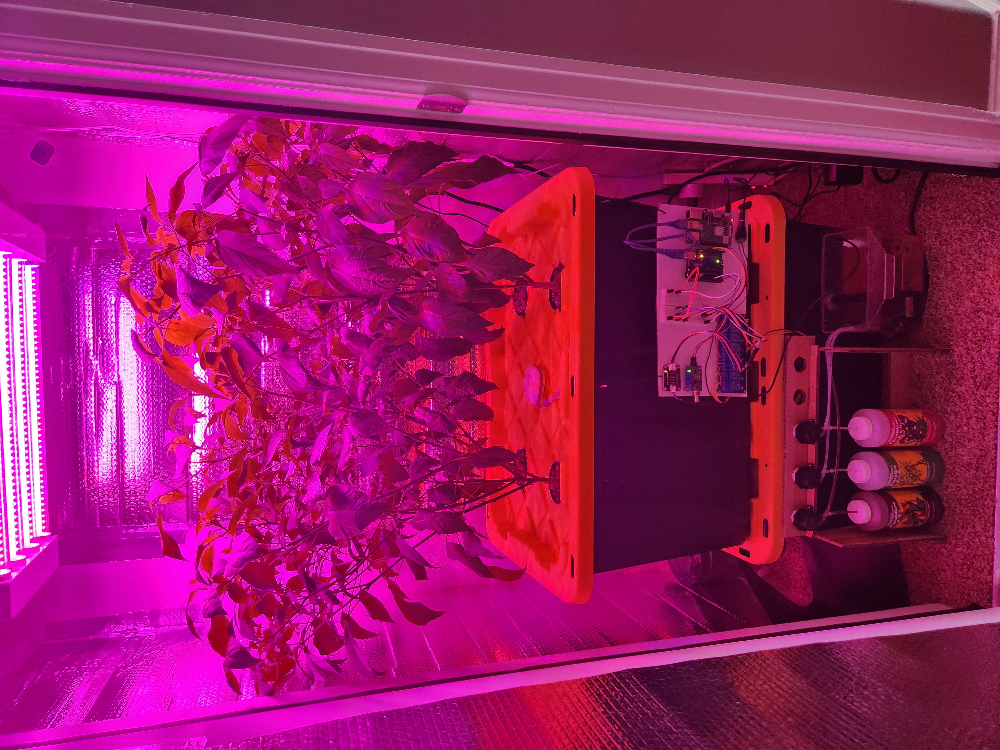
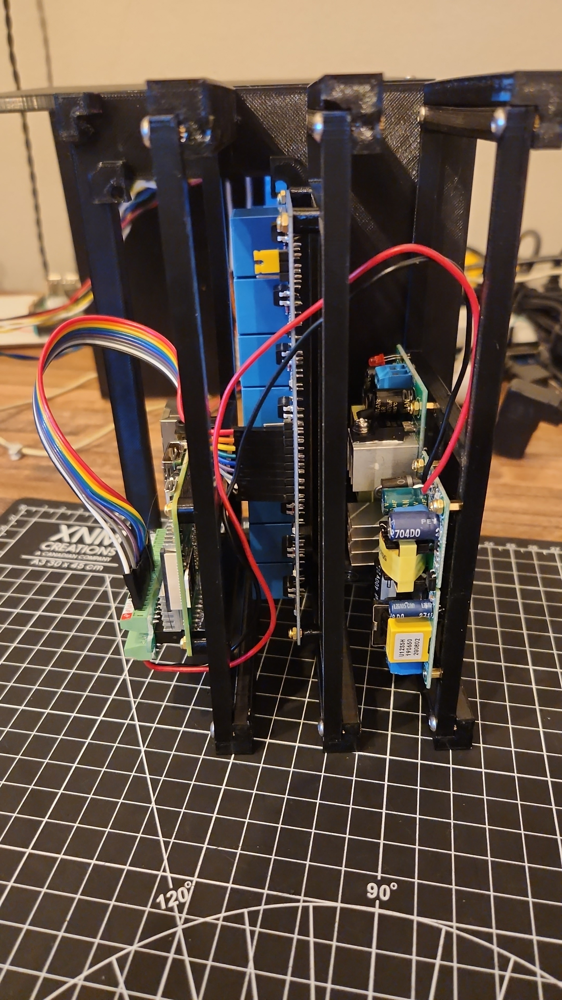
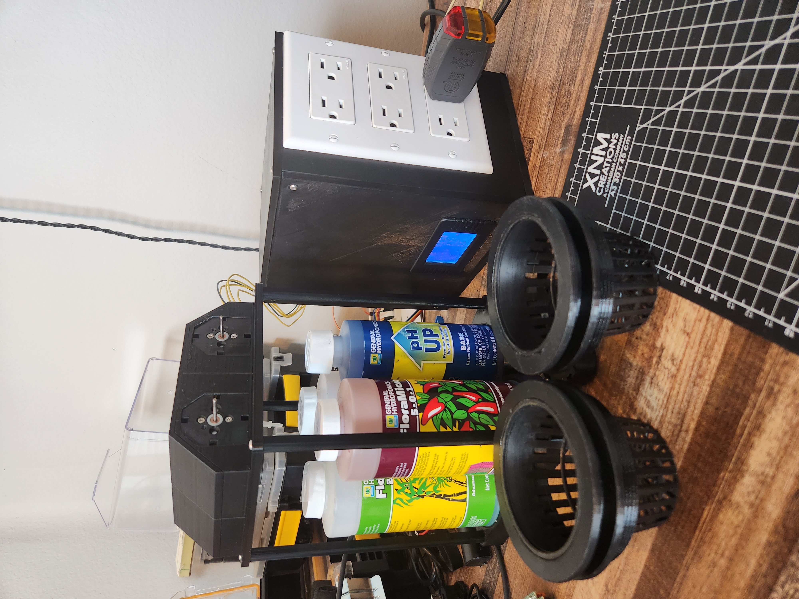
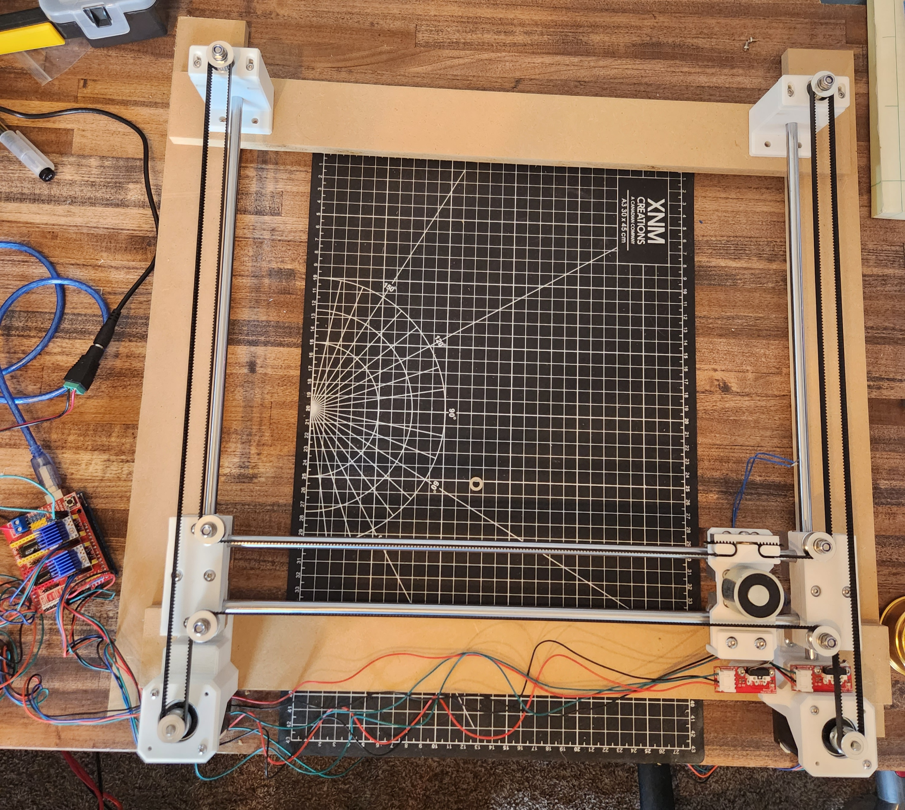
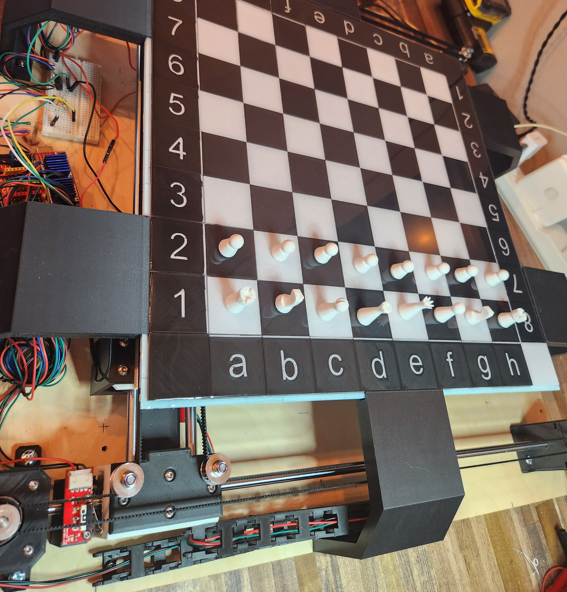
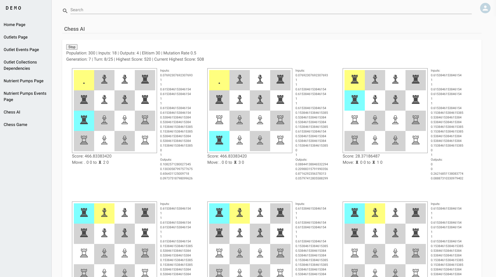

Matt Daisley Dev
=================

Originally planned for just an automated hydropnics system, this project has become a general playground for me to learn new technologies and experiment with different ideas. The project is broken up into several different parts:

- [grow.client](#grow-client) - The front end client for the project. Written in React using the Next.js framework.
- [grow.api](#grow-api) - The api for the project. Written in Node.js using the Nest.js framework.
- [grow.serial.instance](#grow-instance) - A Nest.js standalone app that runs on a Raspberry Pi and communicates with an Arduino over serial.

Eventually I will rename projects to be more generic and less specific to this project. For example, grow.client will become dev.client and grow.api will become dev.api. However, since this is a personal project, I'm not in a rush to do so.

Another key driver in the development of these applications has been to use them as an opportunity to practice developing with the help of ChatGPT and Github Copilot. Large portions of the applications have been written with the help of these tools. Including this Readme!

Lastly, this has been an outlet for me to explore 3D printing and 3D modeling. I cannot tell you how many hours my printer has been running over the last year printing test print after test print for the projects I've played with.

[Chess game on dev.mattdaisley.com](https://dev.mattdaisley.com/testing/chess/5807ac39-9685-46e2-80aa-14bc3a64881e)


## Important note

This is definitely not an example of clean code concepts, test driven development and engineering discipline that I believe is essential for production enterprise applications. This is just to highlight my passion for learning new things and making something I think is cool. This is all code written in my free time with the absolute intention of ignoring all of those best practices and just getting shit done. In the past I've often tried to make my personal projects as clean and organized as a production application and I find that takes away from my enjoyment. I get to do all that for work. At home I just want to play!

# Uses

## Jalepen&#771;o Aeroponic Garden

I won't go into too much detail on this now, but this project gave me a few hundred incredibly spicy jalepen&#771;os over 10 months. This was also the first time I designed and 3D printed my own functional parts. The items in the Final Assembly photo ran for about 3 months with the only interaction from me being to pick jalepen&#771;os, add water once a week, and click some buttons in the website to add nutrient solution every 1-2 weeks.

| Inital Development Prototype in Action | Final Electronics | Final Assembly |
| --- | --- | --- |
|  |  | |


## Chess

A few years ago I saw a kickstarter for an automated chess board that I thought was too cool. Once I got a 3D printer, I decided it was finally time to give it a shot. It's been hundreds of hours of 3D printing and so many iterations of designs to get to this point. But it's finally at the functional MVP point! This is really just V1 because I've made a whole lot of mistakes and made some compromises. That will always happen in the first attempt at building something with skills I've never used before. I'm looking forward to a much sleeker and more functional version 2.0.

The principles of the board are the same as a CNC machine. It's actually using CNC software and instructions to move the pieces. 2 Nema 17 stepper motors drive an electromagnet using Core XY principles. The electromagnet is able to grab the pieces from under the board and move them to the desired location because a small magnet is embedded in each piece.

In the initial design I planned for each square to have a small hall effect sensor to be able to detect when a piece is picked up and placed on any square. This would allow someone to play against an AI or another player who is using the web app.

| Initial Core XY gantry | Current Progress |
| --- | --- |
|  |  |

The code for this isn't fully implemented yet but I'll continue to work on connecting the board with the web interface. At the moment, I have a chess game that has most rules of chess implemented (with heavy help from Github Copilot) and can independently control the board using G-code commands from a python script.

And speaking of AI, I did make an attempt at training a neural network to learn to play chess with the idea of playing against it. This is using a javascript package and trains in the browser. Also implemented with heavy help from Copilot. I've paused this effort until I can get the circuit boards designed and printed for piece detection in each square but I'm looking forward to switching this over to a python library and continuing to learn about neural networks.



# Applications

## Grow Client 

I was interested in learning about the Next.js framework after the React team updated their documentation to note Next.js as the recommended way for building and creating new react applications. Next.js is a framework that allows you to create server side rendered react applications and has a built in routing system that I wanted to try out. 

After a few iterations of the initial development of the Grow application, I have to admit I have pretty much scrapped the server rendering part of this framework. That's not to say it doesn't have it's merits but server rendering lost my attention when I started focusing more on websockets and real-time updates. I may revisit this in the future but for now I'm happy with the way the application is working.

### Websockets

All communication between the client and server is now being done through websocket messages. Although I will always be the only person using this application, I wanted to explore the idea of making an app where every aspect of the application is configurable and updates in real time. Yes it's overly complicated for what I'm trying to do but it's been a lot of fun. 

## Grow Api

The Grow Api project has evolved from a Nest.js REST api to a Nest.js websocket server. As it's just a playground application, I haven't gone in and removed the old controllers that are no longer used. The primary area of focus for this application is the `dynamic` folder and the module contained within.

With every page in the application being configurable, I created this `dynamic gateway` and `dynamic service` to read/write all configuration as requested. All of that configuration is stored in an AWS RDS database. The inital design of the data layer was influenced by various articles about designing a database for use in an AWS DynamoDB database. While I wasn't willing to pay the money for the robustness of DynamoDB, I tried to implement some of the concepts that would apply for the Key-Value document data models. 

## Grow Instance

Designed to run on a Raspberry Pi, this application started out with the responsibility of communicating with an Arduino over serial. I've since expanded that to directly control GPIO pins. The commands for what GPIO pins to turn on/off are sent over a websocket connection and are fully configurable through the Client application.

# Development

Just a few notes that I like to keep around for myself.

## Windows setup

Use nvm to install the latest lts of node and npm https://github.com/coreybutler/nvm-windows

Install Cygwin https://cygwin.com/install.html

Add the rsync package under the Net category. This is required for serial communication between windows and the Arduino.

Save .pem file to connect to aws host in %USERPROFILE%/.ssh

## Docker

Images are hosted in Docker Hub and are built automatically when a commit is pushed to the main branch.

### Manually building and pushing to Docker Hub

```
docker build -t grow.client .
```

Then used visual studio Docker extension to push to Docker Hub

### On AWS EC2 instance

```
docker login
docker pull mattdaisley/grow.client:latest
docker run -p 8080:8080 -d mattdaisley/grow.client:latest
```

Currently just running the client in a container but I'll be updating that to include the Api when I feel like doing it. For now, there isn't a ton of maintanence or too frequent of deployments that I can't handle doing things manually.